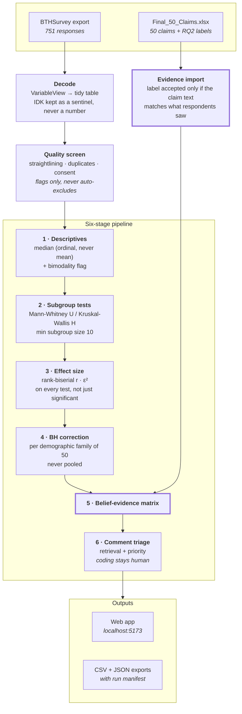

# RQ3 Survey Analysis Tool

Do practitioners believe what software engineering books claim?

Takes a BTHSurvey export of **751 practitioner responses** to **50 folklore claims**,
runs a six-stage nonparametric pipeline, and cross-tabulates what people believe
against what the RQ2 evidence review found.

*Claims Validity of Software Engineering Folklore — BTH PA2534 VT26.*

---

## Results

```
                        SUPPORTED   CONTRADICTED   NO EVIDENCE FOUND
Widely believed                23            3 ⚑                   6
Not widely believed           9 ⚑                6                 3
```

**12 of 41 scored claims (29%) are belief–evidence mismatches.**

| | |
|---|---|
| Respondents | 751 (all 50 claims answered by everyone) |
| Match | 29 — belief agrees with the evidence |
| **Mismatch** | **12** — 3 believed-but-contradicted, 9 not-believed-but-supported |
| Not scored | 9 — `NO EVIDENCE FOUND`, nothing for belief to agree with |
| Significant subgroup differences | 5 of 300 tests, after Benjamini-Hochberg |
| Bimodal claims | 2 — CLM-000026, CLM-000581 |
| Free-text comments | 5,590 |

Quote **12 / 41**, never 12 / 50 — the 9 unscored claims are not in the denominator.

### Three things worth stating in the write-up

**The disbelief column is mostly absence of belief, not rejection.** 8 of the 9
not-believed-but-supported claims sit at median exactly 3.0 — "neither agree nor
disagree". Only CLM-000007 (median 2) is genuine disagreement.

**Some medians rest on a shrinking subset.** 12 claims have an IDK rate ≥ 25%;
CLM-000374 reaches 64.5%. Their medians describe the people who felt able to
answer, not the sample.

**Only 5 subgroup differences survive correction**, 4 of them on *industry*.
Three more were significant at n=743 and dropped out at n=751 — they were noise
at the threshold, not findings.

---

## How it works



**The two thick boxes are the load-bearing ones.** Stage 5 is the RQ3 answer.
The evidence gate exists because claim IDs are *not* unique in the 4,091-claim
corpus — a handed-over summary workbook carried labels reasoned against the
wrong claim for 27 of 50 rows, and the gate caught every one.

---

## Run it

```bash
./run.sh setup     # once: venv, npm install, build data/claims.csv
./run.sh           # start both servers → http://localhost:5173
```

| Page | What's there |
|---|---|
| `/` | All 50 claims — sortable, filterable |
| `/matrix` | **The belief–evidence matrix** |
| `/claims/CLM-000062` | Full audit trail for one claim (see below) |
| `/quality` | Dataset in use, flagged respondents, every exclusion |
| `/methodology` | Every config value that shaped the numbers |

Other commands:

```bash
./run.sh test                                  # 162 tests
./run.sh pipeline --input "data/raw/new.xlsx"  # run against another export
python -m rq3.cli evidence <workbook> --write  # import RQ2 labels
```

### Adding a new export

Drop it in `data/raw/`, then pick it in the Data quality panel or pass
`--input`. Every run is a **full re-run against one file** — exports are never
merged, so a respondent can't be counted twice. Point `dataset.input_file` at it
in `config.yaml` to make it the default.

---

## The claim page

`/claims/{id}` is built so an examiner reading that one page can verify the
result by hand:

**A** claim identity · **B** raw counts for all 751 and every subgroup ·
**C** the arithmetic — rank sums → U or H → tie correction → p → BH rank and
critical value → effect size from pair counts · **D** bimodality thresholds with
observed values · **E** the result · **F** one-line match/mismatch verdict ·
**G** every comment, full text.

The walkthrough is not a re-creation for display — it *is* the computation.
`test_walkthrough.py` asserts each hand-built step lands on exactly what
`scipy.stats` returns, across 100 randomised datasets.

---

## Statistical choices

| Choice | Why | Source |
|---|---|---|
| Median, not mean | Likert items are ordinal | Wohlin et al. (2012); Allen & Seaman (2007) |
| Mann-Whitney / Kruskal-Wallis | nonparametric for ordinal outcomes | Kitchenham et al. (2017) |
| Rank-biserial r | reported for every test, with auditable pair counts | Kerby (2014) |
| \|r\| bands .14 / .33 / .47 | small / medium / large | Romano et al. (2006) |
| BH per variable family | pooling over-corrects; skipping invents findings | Benjamini & Hochberg (1995) |
| Belief × evidence framing | the RQ3 question | Devanbu, Zimmermann & Bird (2016) |
| Sample-only claims | purposive sampling | Baltes & Ralph (2022) |

**Rules that never bend:**

- **IDK** is never numeric and never imputed — excluded from every median and
  test, with its rate reported separately per claim *and* per subgroup.
- **Nothing fails silently.** Anything not analysed appears as an explicit
  exclusion with a reason. 1,888 exclusions are logged in this run.
- **Flag, never auto-exclude.** 3 respondents are flagged (including a 50×IDK
  straightliner); dropping them is a research decision, not a threshold.
- **Deterministic.** Same input + same config → identical numbers, asserted by a
  test that runs the pipeline twice and compares every output table.

---

## Config

Everything tunable lives in [`config.yaml`](config.yaml) and is echoed into every
run manifest and the Methodology panel.

| Key | Value | Note |
|---|---|---|
| `belief.threshold` | `3.5` | **Pending supervisor sign-off.** No claim is within the borderline band, so changing it moves nothing. |
| `belief.borderline_delta` | `0.2` | flags provisional cell placement |
| `comparisons.min_subgroup_size` | `10` | was 3 — flagged as a bug and fixed |
| `descriptives.high_idk_rate_pct` | `25.0` | IDK review flag |
| `evidence.min_text_similarity` | `0.60` | the claim-identity gate |
| `belief.unscored_labels` | `NO EVIDENCE FOUND` | excluded from match/mismatch |

Evidence labels are **three categories only**. Strength qualifiers
(`SUPPORTED (weak evidence)`, `SUPPORTED / WEAK EVIDENCE`, …) collapse onto the
base label, with the wording preserved in `evidence_strength` — nothing is lost,
but the matrix stays 2 × 3.

---

## Layout

```
config.yaml              every tunable value
run.sh                   one-command startup
backend/rq3/
  decode.py              BTHSurvey export → tidy table
  claims.py  evidence.py claim metadata · RQ2 label import + gate
  quality.py             low-effort / duplicate screening
  analysis/              stages 1–6, one module each
  pipeline.py  api.py    orchestration · FastAPI
frontend/src/            React + TypeScript + Vite + Recharts
data/
  claims.csv             GENERATED — safe to rebuild
  claims_evidence.csv    RQ2 labels — hand-maintained
  source/                Final_50_Claims.xlsx
  raw/ processed/        respondent-level — NOT in Git
  results/<run_id>/      aggregate exports + manifest
```

---

## Data protection

Responses were collected under a consent form. `data/raw/` and
`data/processed/`, plus `full_run.json` and `flagged_respondents.csv` (which
carry comments and per-respondent demographics), are **excluded from Git**.

Committed results are aggregate only. Each run manifest records the input file's
SHA-256, so a published number ties back to the exact export without that export
being in the repository.

---

## Known limitations

- **Purposive sampling.** Results describe this sample, not practitioners in
  general. Carried as a banner on every screen and a comment line in every CSV.
- **Fixed question order.** BTHSurvey has no randomisation; order effects can't
  be estimated. Documented, not corrected.
- **Country is thin.** Only 8 of 42 countries reach n ≥ 10, with 56 respondents
  not answering — which is why country yields no significant results.
