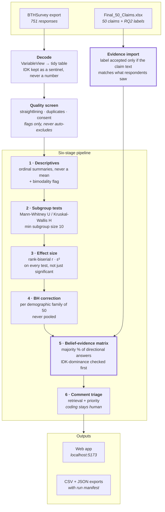

# RQ3 Survey Analysis Tool

Do practitioners believe what software engineering books claim?

Takes a BTHSurvey export of **751 practitioner responses** to **50 folklore claims**,
runs a six-stage nonparametric pipeline, and cross-tabulates what people believe
against what the RQ2 evidence review found.

*Claims Validity of Software Engineering Folklore — BTH PA2534 VT26.*

---

## Results

```
                        SUPPORTED   CONTRADICTED   NO EVIDENCE FOUND   ROW TOTAL
Majority agreed                21            4 ⚑                   4          29
Majority disagreed            1 ⚑                2                  1           4
                       ----------   ------------   -----------------   ---------
                               22              6                   5          33
```

**5 of 28 scored claims (17.9%) are belief–evidence mismatches.**

| | |
|---|---|
| Respondents | 751 (all 50 claims answered by everyone) |
| Claims reaching a clear majority | 33 — these form the matrix |
| No clear majority | 5 — neither side passed 50% of directional answers |
| IDK-dominant | 12 — 30%+ of the full sample could not answer |
| Match | 23 — the majority position agrees with the evidence |
| **Mismatch** | **5** — 4 agreed-but-contradicted, 1 disagreed-but-supported |
| Not scored | 5 — `NO EVIDENCE FOUND`, nothing for belief to agree with |
| Significant subgroup differences | 5 of 300 tests, after Benjamini-Hochberg |
| Bimodal claims | 2 — CLM-000026, CLM-000581 |
| Free-text comments | 5,590 |

Quote **5 / 28**, never 5 / 50. The denominator is the scored claims only: 17 of
the 50 never reach the matrix (5 mixed, 12 IDK-dominant), and 5 more carry
`NO EVIDENCE FOUND`, which cannot be scored either way.

Across all 50 claims the RQ2 review labelled **32 SUPPORTED**, **10 CONTRADICTED**
and **8 NO EVIDENCE FOUND**.

### Three things worth stating in the write-up

**Belief mostly tracks the evidence.** 23 of 28 scored claims match. The five that
do not are the finding: CLM-000045, CLM-000085, CLM-000169 and CLM-000496 are
agreed with despite being contradicted; CLM-000007 is disagreed with despite being
supported.

**Two claims sit marginally inside the matrix and should be reported as such.**
CLM-000085 clears the 50% line by two respondents (329 / 654 = 50.31%) and is one
of the five mismatches; CLM-000337 clears it by four (326 / 644 = 50.62%) and is a
match. A handful of different answers would move either into the mixed bucket.

**`NO EVIDENCE FOUND` is a finding, not a null result.** 8 claims are presented as
guidance in practitioner literature yet are unaddressed by the empirical
literature. Four of them command a clear majority. Those point directly at where
future work would be useful, which is why they keep their own column rather than
being folded into the mismatch count.

**A shrinking denominator is reported, never hidden.** 12 claims are IDK-dominant
and excluded from the matrix; CLM-000374 reaches 64.6%. Their directional split
would describe a self-selected minority, so the tool refuses to classify them.

---

## How it works



**The two thick boxes are the load-bearing ones.** Stage 5 is the RQ3 answer.
The evidence gate exists because claim IDs are *not* unique in the 4,091-claim
corpus — a handed-over summary workbook carried labels reasoned against the
wrong claim for 27 of 50 rows, and the gate caught every one.

### Stage 5, in full

Every claim lands in exactly one of three buckets, evaluated in this order:

1. **IDK-dominant** — 30% or more of the *full sample* (IDK included) answered
   "I don't know". The claim is reported on its own terms and never classified.
   This test runs first and short-circuits the rest.
2. **Clear direction** — more than 50% of the *directional* denominator (the five
   substantive Likert points, IDK excluded) fell on one side. Neutral answers
   count toward the denominator but toward neither side. The claim enters the
   matrix as **Majority agreed** or **Majority disagreed**.
3. **Mixed** — neither side passed 50%. An exact 50/50 split is mixed, not a
   majority; the rule is strictly greater than.

Only clear-direction claims enter the matrix. A claim is a **mismatch** when the
majority agreed with a `CONTRADICTED` claim, or disagreed with a `SUPPORTED` one.

---

## Run it

```bash
./run.sh setup     # once: venv, npm install, build data/claims.csv
./run.sh           # start both servers → http://localhost:5173
```

| Page | What's there |
|---|---|
| `/` | All 50 claims — sortable, filterable |
| `/matrix` | **The belief–evidence matrix** |
| `/conclusions` | The findings, presentation-ready |
| `/claims/CLM-000062` | Full audit trail for one claim (see below) |
| `/quality` | Dataset in use, flagged respondents, every exclusion |
| `/methodology` | Every config value that shaped the numbers |

Other commands:

```bash
./run.sh test                                  # 182 tests
./run.sh pipeline --input "data/raw/new.xlsx"  # run against another export
python -m rq3.cli evidence <workbook> --write  # import RQ2 labels
```

### Adding a new export

Drop it in `data/raw/`, then pick it in the Data quality panel or pass
`--input`. Every run is a **full re-run against one file** — exports are never
merged, so a respondent can't be counted twice. Point `dataset.input_file` at it
in `config.yaml` to make it the default.

---

## The claim page

`/claims/{id}` is built so an examiner reading that one page can verify the
result by hand:

**A** claim identity · **B** raw counts for all 751 and every subgroup ·
**C** the arithmetic — rank sums → U or H → tie correction → p → BH rank and
critical value → effect size from pair counts · **D** bimodality thresholds with
observed values · **E** the result · **F** one-line match/mismatch verdict ·
**G** every comment, full text.

The walkthrough is not a re-creation for display — it *is* the computation.
`test_walkthrough.py` asserts each hand-built step lands on exactly what
`scipy.stats` returns, across 100 randomised datasets.

---

## Statistical choices

| Choice | Why | Source |
|---|---|---|
| Ordinal summaries, not means | Likert items are ordinal | Wohlin et al. (2012); Allen & Seaman (2007) |
| Majority % on a directional denominator | reports the direction people took, without imputing a number to IDK | — |
| Mann-Whitney / Kruskal-Wallis | nonparametric for ordinal outcomes | Kitchenham et al. (2017) |
| Rank-biserial r | reported for every test, with auditable pair counts | Kerby (2014) |
| \|r\| bands .14 / .33 / .47 | small / medium / large | Romano et al. (2006) |
| BH per variable family | pooling over-corrects; skipping invents findings | Benjamini & Hochberg (1995) |
| Belief × evidence framing | the RQ3 question | Devanbu, Zimmermann & Bird (2016) |
| Sample-only claims | purposive sampling | Baltes & Ralph (2022) |

**Rules that never bend:**

- **IDK** is never numeric and never imputed — excluded from the directional
  denominator and from every test, with its rate reported separately per claim
  *and* per subgroup.
- **Nothing fails silently.** Anything not analysed appears as an explicit
  exclusion with a reason. 1,888 exclusions are logged in this run.
- **Flag, never auto-exclude.** 3 respondents are flagged (including a 50×IDK
  straightliner); dropping them is a research decision, not a threshold.
- **Deterministic.** Same input + same config → identical numbers, asserted by a
  test that runs the pipeline twice and compares every output table.

---

## Config

Everything tunable lives in [`config.yaml`](config.yaml) and is echoed into every
run manifest and the Methodology panel.

| Key | Value | Note |
|---|---|---|
| `belief.idk_dominance.threshold` | `0.30` | share of the **full sample** answering IDK that removes a claim from the matrix; evaluated first |
| `belief.majority.threshold` | `0.50` | share of the **directional** denominator one side must exceed; strictly greater than |
| `belief.unscored_labels` | `NO EVIDENCE FOUND` | excluded from match/mismatch |
| `comparisons.min_subgroup_size` | `10` | was 3 — flagged as a bug and fixed |
| `evidence.min_text_similarity` | `0.60` | the claim-identity gate |
| `experience_split` | 153 / 598 | Under 10 years vs 10+ years |

There is **no median threshold**. An earlier draft classified claims by median
≥ 3.5; that rule was replaced by the percentage majority rule above, and the
`belief.threshold` and `belief.borderline_delta` keys were removed entirely.

Evidence labels are **three categories only**. Strength qualifiers
(`SUPPORTED (weak evidence)`, `SUPPORTED / WEAK EVIDENCE`, …) collapse onto the
base label, with the wording preserved in `evidence_strength` — nothing is lost,
but the matrix stays 2 × 3.

---

## Layout

```
config.yaml              every tunable value
run.sh                   one-command startup
backend/rq3/
  decode.py              BTHSurvey export → tidy table
  claims.py  evidence.py claim metadata · RQ2 label import + gate
  quality.py             low-effort / duplicate screening
  analysis/
    descriptives.py      stage 1
    comparisons.py       stage 2      effects.py   stage 3
    correction.py        stage 4      buckets.py   stage 5 bucketing
    matrix.py            stage 5      comments.py  stage 6
    experience.py        two-group experience analysis
  pipeline.py  api.py    orchestration · FastAPI
  scripts/               standalone provenance checks
frontend/src/            React + TypeScript + Vite + Recharts
data/
  claims.csv             GENERATED — safe to rebuild
  claims_evidence.csv    RQ2 labels — hand-maintained
  source/                Final_50_Claims.xlsx and the RQ2 label workbooks
  raw/ processed/        respondent-level — NOT in Git
  results/<run_id>/      aggregate exports + manifest
```

---

## Data protection

Responses were collected under a consent form. `data/raw/` and
`data/processed/`, plus `full_run.json` and `flagged_respondents.csv` (which
carry comments and per-respondent demographics), are **excluded from Git**.

Committed results are aggregate only. Each run manifest records the input file's
SHA-256, so a published number ties back to the exact export without that export
being in the repository.

---

## Known limitations

- **Purposive sampling.** Results describe this sample, not practitioners in
  general. Carried as a banner on every screen and a comment line in every CSV.
- **Fixed question order.** BTHSurvey has no randomisation; order effects can't
  be estimated. Documented, not corrected.
- **Country is thin.** Only 8 of 42 countries reach n ≥ 10, with 56 respondents
  not answering. The pipeline still runs the 50 country tests and exports them;
  none survives BH correction. The thesis excludes country from subgroup
  reporting on sample-concentration grounds, so the exported country results
  should not be read as a reported finding.
